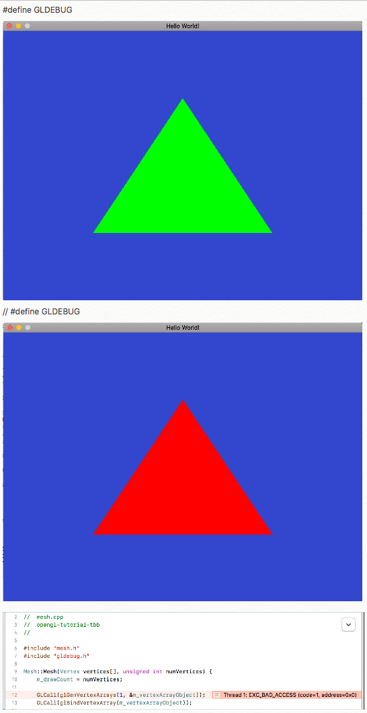

# opengl-tutorial-tbb

Following along in this opengl tutorial: https://www.youtube.com/playlist?list=PLEETnX-uPtBXT9T-hD0Bj31DSnwio-ywh

I like this series because it:

	* addresses basic opengl concepts
	* shows how to abstract opengl programming with c++ classes
	* employs a portable and modern windowing sdk (SDL2) to wrapper our opengl renderings
	* discusses the programmable GPU pipeline

# Build dependencies from source

I've included some Xcode project files in my repo, but they assume the following dependencies have been installed under

	../dependencies/include
	../dependencies/lib

To accomplish this, I downloaded the following src zip files:

	* SDL2-2.0.7.zip
	* glew-2.1.0.zip
	* glm-0.9.8.5.zip
	* debugbreak-7ee9b29.zip (https://github.com/scottt/debugbreak)

and staged them under:

	../dependencies-srczip

then built and installed them to ../dependencies with:

	make
	make install

With that out of the way, I can now build from within the Xcode IDE for a better dev workflow.  There's probably a more unified way to do all this, but I'm trying not to get too snarled up in build generality.

Strangely, my first attempt at running the wafer-thin example code that just brings up an empty SDL window failed with a borderless window (with no title or sizing decorations).  I speculate this was a dynamic link library search path issue which probably could be resolved by tweaking the embedded rpath of the executable through Xcode's Build Settings: Linking/Runpath Search Paths or tweaking with the dynamic library search path at the shell level.  I opted for just going with static linking by removing the dynamically linked libraries out of the dependencies directory and rebuilding from within Xcode.

# Getting Tutorial 3.5 to build and render is a Thing

Lightness and dark, a metaphor for life and opengl programming.  You type the code in perfectly and are rewarded with an empty rendering window.  It's a dark alley and you're not sure how to proceed.

I double checked the code, started reading the comment section of the youtube video, and looked for general strategies for OpenGL debugging, then slept on it so my subconcious could churn away on the mystery.

Cutting to the chase, I hit two issues:

	* mesh.cpp Mesh::Mesh constructor fails in glGenVertexArrays() with EXC_BAD_ACCESS
	* main.cpp main() vertices specified in clockwise order were getting culled by uplevel display.cpp from github.

I fixed the first issue in display.cpp by enabling glewExperimental:

```
display.cpp
    ...
    Display::Display(...)

    //
    // NB: Avoid "Thread 1: EXC_BAD_ACCESS (code=1, address=0x0)"
    // https://stackoverflow.com/questions/13558073/program-crash-on-glgenvertexarrays-call
    //
>>> glewExperimental = GL_TRUE;
    
    GLenum res = glewInit();
    ...
```

I fixed the second issue by reording the verties in counter-clockwise order:

```
main.cpp

    int main(...)
    ...
    Vertex vertices[] =
    {
        // NB: Vertices specified in counter-clockwise order are
        //     interpreted as front-facing by convention.
        //
        // This is important to know if your code culls back-facing vertices
        // and you mistakenly specify them in clockwise order ...
        // and now are wondering why your rendering window is blank. :-/

        Vertex(glm::vec3(-0.5, -0.5, 0.0)),
>>>     Vertex(glm::vec3( 0.5, -0.5, 0.0)),
>>>     Vertex(glm::vec3( 0.0,  0.5, 0.0))
    };
```



In the process, I picked up some debug strategies that should serve me nicely going forward:

* Leveraged Yan Cherno's [GLCall() wrapper](https://github.com/zenglenn42/opengl-tutorial-tbb/blob/master/opengl-tutorial-tbb/gldebug.h) that breaks to the debugger when glError complains.

* Used Scott Tsai's [debug_break()](https://github.com/scottt/debugbreak) function to extend GLCall to gcc, clang, and msvc compilers.

* Crafted debug [vertex](https://github.com/zenglenn42/opengl-tutorial-tbb/blob/master/Resources/debugShader.vs) and [fragment](https://github.com/zenglenn42/opengl-tutorial-tbb/blob/master/Resources/debugShader.fs) shaders that allow easy overrides for incoming and outgoing variables.

Even after deploying theCherno's debug fu and wrangling community suggestions, I still had a blank window after a full day of effort.  In the morning, I realized I didn't know if the issue was on the CPU or GPU side.  Was there are problem with the mesh vertices getting sent down?  Was it some backlevel driver weirdness on macOS?

Even with the skeleton shaders, my render window was blank, so I shifted my focus upstream to the CPU side.  I dropped the mesh vertices array from the tutorial and just made my own legacy mesh using the fixed pipeline idiom:

```
glBegin(GL_TRIANGES);
glVertex3f(); glVertex3f(); glVertex3f();
glEnd();
```
Still, no joy.

I punted on GL_TRIANGLES and opted for GL_LINES and /finally/ got something on the screen.  

But even that was a bit rough for dumb reasons ... me forgetting that you need pairs of vertices to draw one line segment as opposed to a mistaken connect-the-dots assumption about how that worked.  Oddly, that also got me looking into controlling line color at the shader level.  That led to discussions of gl_FrontColor and gl_BackColor within the GLSL shader language and backed me into the crucial realization that front-facing meshes are specified with vertices in /counter-clockwise/ order and in the tutorial, they're specified in /clockwise/ order (which is probably anti-pattern).

If I had just recreated the live display.cpp code from the youtube tutorial, the vertex ordering would not be an issue. But I kinda mixed and matched live code with stuff I pulled from the uplevel [github repo](https://github.com/BennyQBD/ModernOpenGLTutorial/blob/master/display.cpp#L29).  In the repo code, culling of GL_BACK vertices had been enabled which then culled the clockwise-ordered vertices in the live code of main().

Some clouds have lifted and light now streams in, gracing my keyboard and spirits.
