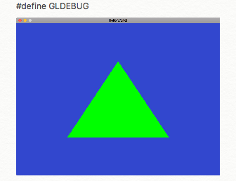
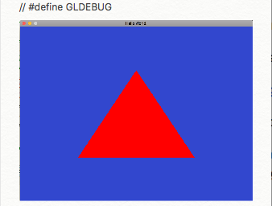
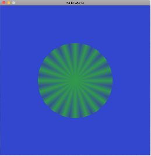
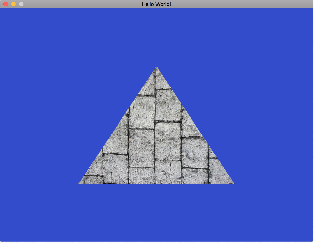

# opengl-tutorial-tbb

Following along in this opengl tutorial: https://www.youtube.com/playlist?list=PLEETnX-uPtBXT9T-hD0Bj31DSnwio-ywh

I like this series because it:

	* addresses basic opengl concepts
	* shows how to abstract opengl programming with c++ classes
	* employs a portable and modern windowing sdk (SDL2) to wrapper our opengl renderings
	* discusses the programmable GPU pipeline

# Build dependencies from source

I've included some Xcode project files in my repo, but they assume the following dependencies have been installed under

	../dependencies/include
	../dependencies/lib

To accomplish this, I download the following src zip files:

	* SDL2-2.0.7.zip  http://www.libsdl.org/release/SDL2-2.0.7.zip
	* glew-2.1.0.zip  https://sourceforge.net/projects/glew/files/glew/2.1.0/glew-2.1.0.zip/download
	* glm-0.9.8.5.zip https://github.com/g-truc/glm/archive/0.9.8.5.zip
	* debugbreak-7ee9b29.zip https://github.com/scottt/debugbreak
	* stb-36afb9c.zip https://github.com/nothings/stb

and stage them under:

	../dependencies-srczip

then build and install them to ../opengl-tutorial-tbb-dependencies with:

	make
	make install

With that out of the way, I can now build from within the Xcode IDE for a better dev workflow.  There's probably a more unified way to do all this, but I'm trying not to get too snarled up in build generality.

Strangely, my first attempt at running the wafer-thin example code that just brings up an empty SDL window fails with a borderless window (with no title or sizing decorations).  I speculate this is a dynamic link library search path issue which probably can be resolved by tweaking the embedded rpath of the executable through Xcode's Build Settings: Linking/Runpath Search Paths or tweaking with the dynamic library search path at the shell level.  I opt for just going with static linking by removing the dynamically linked libraries out of the dependencies directory and rebuilding from within Xcode.

# Getting [Tutorial 3.5](https://www.youtube.com/watch?v=0jML5fMBDGg) to build and render is a Thing

Lightness and dark, a metaphor for life and opengl programming.  You type the code in perfectly and are rewarded with an empty rendering window.  It's a dark alley and you're not sure how to proceed.

I double check the code, start reading the comment section of the youtube video, and look for general strategies for OpenGL debugging, then sleep on it so my subconcious can churn away on the mystery.

Cutting to the chase, I discover two issues:

	* mesh.cpp Mesh::Mesh constructor fails in glGenVertexArrays() with EXC_BAD_ACCESS
	* main.cpp main() vertices specified in clockwise order were getting culled by uplevel display.cpp from github.

I fix the first issue in mesh.cpp:


by enabling glewExperimental in display.cpp:

```
display.cpp
    ...
    Display::Display(...)

    //
    // NB: Avoid "Thread 1: EXC_BAD_ACCESS (code=1, address=0x0)"
    // https://stackoverflow.com/questions/13558073/program-crash-on-glgenvertexarrays-call
    //
>>> glewExperimental = GL_TRUE;
    
    GLenum res = glewInit();
    ...
```

I fix the second issue by reording the verties in counter-clockwise order so they are interpreted as front-facing:

```
main.cpp

    int main(...)
    ...
    Vertex vertices[] =
    {
        // NB: Vertices specified in counter-clockwise order are
        //     interpreted as front-facing by convention.
        //
        // This is important to know if your code culls back-facing vertices
        // and you mistakenly specify them in clockwise order ...
        // and now are wondering why your rendering window is blank. :-/

        Vertex(glm::vec3(-0.5, -0.5, 0.0)),
>>>     Vertex(glm::vec3( 0.5, -0.5, 0.0)),
>>>     Vertex(glm::vec3( 0.0,  0.5, 0.0))
    };
```

In the process, I pick up some debug strategies that should serve me nicely going forward:

* Leverage Yan Cherno's [GLCall() wrapper](https://github.com/zenglenn42/opengl-tutorial-tbb/blob/master/opengl-tutorial-tbb/gldebug.h) that breaks to the debugger when glError complains.

* Use Scott Tsai's [debug_break()](https://github.com/scottt/debugbreak) function to extend GLCall to gcc, clang, and msvc compilers.

* Craft debug [vertex](https://github.com/zenglenn42/opengl-tutorial-tbb/blob/master/Resources/debugShader.vs) and [fragment](https://github.com/zenglenn42/opengl-tutorial-tbb/blob/master/Resources/debugShader.fs) shaders that allow easy overrides for incoming and outgoing variables.

Even after deploying [theCherno's debug fu](https://www.youtube.com/watch?v=FBbPWSOQ0-w&index=10&list=PLlrATfBNZ98foTJPJ_Ev03o2oq3-GGOS2) and wrangling community suggestions, I still have a blank window after a full day of effort.  In the morning, I realize I don't know if the issue is on the CPU or GPU side.  Is there a problem with the mesh vertices getting sent down?  Backlevel driver weirdness on macOS?  Are the shaders even *firing*?  I mean, I *think* they're firing.  I don't see any compile or link errors along that path.  But how could I test that?  With some stripped down shaders, I can hardcode the fragment color and should see a new color to my blank window ... yeah, that works.  So I shift focus to the CPU side, dropping the mesh vertices array from the tutorial code and just wedging in my own legacy mesh triangle using the classic [immediate-mode](https://stackoverflow.com/questions/6733934/what-does-immediate-mode-mean-in-opengl) idiom:

```
glBegin(GL_TRIANGES);
   // Heads-up: Notice the clockwise ordering?
   //
   //           This will be interpreted as the 
   //           back face of the triangle by default
   //           by OpenGL. :-/
   glVertex3f(-0.5f, -0.5f, 0.0f); 
   glVertex3f(0.0f, 0.5f, 0.0f); 
   glVertex3f(0.5f, -0.5f, 0.0f);
glEnd();
```

This is facilitated in the debug [vertex shader](https://github.com/zenglenn42/opengl-tutorial-tbb/blob/master/Resources/debugShader.vs#L11) by calling ftransform:

```
gl_Position = ftransform();
```

Still, no joy.

I punt on GL_TRIANGLES and opt for GL_LINES and /finally/ get something on the screen.  

But even that is a bit rough for dumb reasons ... me forgetting that you need pairs of vertices to draw one line segment as opposed to a mistaken connect-the-dots assumption about how that works.  Oddly, that also gets me looking into controlling line color at the shader level.  That leads to discussions of gl_FrontColor and gl_BackColor within the GLSL shader language and backs me into the crucial realization that front-facing meshes are specified with vertices in *counter-clockwise* order and in the tutorial they're specified in *clockwise* order (which is probably anti-pattern).

If I had just recreated the live display.cpp code from the youtube tutorial, the vertex ordering would not be an issue since there is no vertex culling in *that* code. But I kinda mix and match live code with stuff I pull from the uplevel [github repo](https://github.com/BennyQBD/ModernOpenGLTutorial/blob/master/display.cpp#L29).  In the repo code, culling of GL_BACK vertices is enabled, killing off the clockwise-ordered mesh of vertices in the live code of main().  Once I realize that, I revert back to my dummied-up GL_TRIANGLES and relize I've made the same mistake of specifying them in clockwise order.  Once I move them to counter-clockwise, I'm rewarded with a green triangle courtesy my debug shaders:



Now I backout of my debug paths entirely and use my cleaned-up version of the live code from the tutorial video and the coveted red triangle now appears:



the product of nice c++ abstraction, gpu-efficient [retained-mode](https://stackoverflow.com/questions/6733934/what-does-immediate-mode-mean-in-opengl) programmable pipeline, and a modern windowing sdk (SDL2).

Some clouds lift. [Light now plays with shadow](http://glslsandbox.com/e#44945.0), gracing my keyboard and spirits.

# Okay, but how do I make all this work with my models?

... especially since my previous OpenGL work relied upon the GLUT layer I'm trying to deprecate for modeling primitives like glutSolidCone.

I'm tempted to take a diversion through a few threads so I can render a 3D cone in retained mode instead of a humble triangle.

Specifically, these threads

[immediate-to-retained-mode](https://stackoverflow.com/questions/6733934/what-does-immediate-mode-mean-in-opengl)

[display-list-to-vbo](https://stackoverflow.com/questions/26189645/opengl-convert-from-displaylist-to-use-vbo)

[retained-mode-history-lesson](https://stackoverflow.com/questions/21652546/what-is-the-role-of-glbindvertexarrays-vs-glbindbuffer-and-what-is-their-relatio)

[computing-cone-surface-normals](https://stackoverflow.com/questions/19245363/opengl-glut-surface-normals-of-cone)

[cross-platform-opengl-headers](https://stackoverflow.com/questions/3907818/opengl-headers-for-os-x-linux)

[vao-vab-dance](https://www.opengl.org/discussion_boards/showthread.php/198202-Multiple-vba-s-single-buffer)

seem nutrient dense for my purposes.  Hmmm, that looks like a bit of work. Not sure if I'm ready for all that kodified-kale just yet, but that's in the back of my mind as I reach for the Téo Gelato and press play on the next tutorial.

Huh, maybe I can use [gluCylinder](http://pyopengl.sourceforge.net/documentation/manual-3.0/gluCylinder.html) with top radius = 0 to make my cone. (Dang, doesn't look like GLU is available on mobile since it is not implemented with OpenGL ES.)

# Programmatic model of a cone

Went ahead and cleaned up a [programmatic model of a cone](https://github.com/zenglenn42/opengl-tutorial-tbb/blob/master/opengl-tutorial-tbb/cone.cpp) based upon triangle fans.  It's still immediate mode, but gets me closer to something that will load up into a vertex buffer object.



This is a view from the top, so it appears as a circle in two dimensions.

# All your stoned doritos are belong to us!

Work through thebennybox's [Tutorial 4 OpenGL Textures](https://www.youtube.com/watch?v=17axYo6mKhY&list=PLEETnX-uPtBXT9T-hD0Bj31DSnwio-ywh&index=9).

This requires pulling in another 3rd party dependency, [stb_image](https://github.com/nothings/stb), for loading in the texture image itself.  In theory, I think SDL2 could do this, but for now I'm just along for the ride.

At some point in the progression, I get this:


but make the mistake of *not* committing my interesting code and end up diverging to *no* triangle showing up on the screen.  :-/

Eventually, I opt for grabbing a youtube commenter's reworked mesh.h/mesh.cpp which seems a bit more canonical anyway and, bam!, I get:



I'm liking this [menagerie](http://theactingcompany.org/plays/2017-18-season/the-glass-menagerie-1996-97) of opengl code ... debugged (at least for one platform :-) and arrayed upon my github shelf.


# Texture Tutorial Reprise

It bugs me that I can't get the live tutorial code working, so I rewatch the video and fix that.  I've still got the alternate implementation checked in.  It's just a conditional compile away by commenting out this macro in main.cpp:

```
#define TUTORIAL_IMPLEMENTATION
...
int main()
{
  ...
}
```

The main difference is the tutorial video employs multiple data buffers segregated by attribute (i.e., position versus texture coordinate).

The alternate implementation (courtesy Donovan Green) uses a single data buffer described to the shaders with slightly fancier vertex attribute pointers.

# [Model Transform Tutorial](https://youtu.be/Xe7FmplKAF0)

Okay, so now we have a nice [class](https://github.com/zenglenn42/opengl-tutorial-tbb/blob/master/opengl-tutorial-tbb/transform.h#L12) for translating, rotating, and scaling our models by leveraging a [transform uniform variable](https://github.com/zenglenn42/opengl-tutorial-tbb/blob/master/opengl-tutorial-tbb/shader.cpp#L31) in our vertex shader.  The uniform is updated on the CPU side between [draw invocations](https://github.com/zenglenn42/opengl-tutorial-tbb/blob/master/opengl-tutorial-tbb/main.cpp#L65) and is picked up by the vertex shader where it mutates gl_Position:

basicShader.vs

```
    #version 120

    attribute vec3 position;
    attribute vec2 texCoord;

    varying vec2 texCoord0;

>>> uniform mat4 transform;

    void main()
    {
>>>     gl_Position = transform * vec4(position, 1.0); // last param affects xlation
        texCoord0 = texCoord;
    }

```

Now the stone dorito flies around the screen and scales as well.

  

# [Tutorial 6](https://youtu.be/e3sc72ZDDpo) Camera and Perspective Transforms

With this lesson we get a [camera transform](https://github.com/zenglenn42/opengl-tutorial-tbb/blob/master/opengl-tutorial-tbb/camera.h) that allows us to view our flying dorito in perspective.


# [Tutorial 7](https://youtu.be/NS980twY1ZE) File-based mesh and Lambertian lighting

We wrap up with a more complicated monkey mesh exported from Blender and lit using [Lambertian lighting](https://en.wikipedia.org/wiki/Lambertian_reflectance).


# Huh, can we get a user-interface for that monkey?

It seems like a reasonable question.  Sure, the motion-transforming stone monkey in its own window is nice, but an ability to select textures on the fly or maybe pause the movement seems a modest enhancement.

But then the question of portability crops up.  UI's are inherently tied to the look and feel of the target platform and generally require you to compile and link against some platform SDK.

However, do I really want to take the plunge on one platform's UI idiosyncrasies?  Maybe someone has done some of the hard work of creating a cross-platformm UI solution.

Among some [options](https://insights.dice.com/2016/11/18/5-cross-platform-guis-for-c/) for C++ developers discussed here, Qt and wxWidgets look interesting.

But is there something lighter weight I can slap into the build?  Along the lines of GLUT/GLUI?

Turns out there are some [SDL2 widgets](http://members.chello.nl/w.boeke/SDL-widgets/index.html) running around in the world.  Presumably these are confered with SDL's inherent portability.

# Building SDL-widgets' dependencies ...

I'd like to build SDL-widgets (and any of its dependencies) from source in keeping with my current pattern.

Roughly, I learn:

	SDL2-widgets --depends-upon--> SDL2_ttf (for TrueType font support)

	SDL2_ttf --depends-upon--> freetype2 (for general font rendering)

## Building freetype

I snag the freetype source archive off the web and notice it has a cmake build front-end.  But trying that doesn't seem to build / install freetype-config on macOS (10.13).  This is required by the upstream SDL2_ttf build, so time to dig in deeper.

The official freetype build readme says the cmake offering is a community add-on, but the *supported* OS X build is the lower-level unix-style autotools build.  Doing that *works*.

## Building SDL_ttf

This also looks to be a classic "configure / make / make install" build as well.  Using this configuration:

```
../configure --with-freetype-prefix=/path/2/opengl-tutorial-tbb-dependencies 
             --with-sdl-prefix=/path/2/opengl-tutorial-tbb-dependencies 
             --prefix=/path/2/opengl-tutorial-tbb-dependencies
```
gets me past the compile stage, but I'm hitting a mighty number of missing symbols at libtool link-time:

```
libtool: link: gcc -dynamiclib  -o .libs/libSDL2_ttf-2.0.0.dylib  .libs/SDL_ttf.o   
   -L/path/2/opengl-tutorial-tbb-dependencies/lib /path/2/opengl-tutorial-tbb-dependencies/lib/libfreetype.dylib -lz -lbz2 
   -L/path/2/opengl-tutorial-tbb-dependencies/lib -lSDL2    
   -install_name /path/2/opengl-tutorial-tbb-dependencies/lib/libSDL2_ttf-2.0.0.dylib 
   -compatibility_version 15 -current_version 15.0 -Wl,-single_module
Undefined symbols for architecture x86_64:
  "_AudioObjectAddPropertyListener", referenced from:
      _COREAUDIO_Init in libSDL2.a(SDL_coreaudio.m.o)
      _audioqueue_thread in libSDL2.a(SDL_coreaudio.m.o)
  ..."
  "_objc_sync_enter", referenced from:
      _ScheduleContextUpdates in libSDL2.a(SDL_cocoawindow.m.o)
      -[SDLOpenGLContext setWindow:] in libSDL2.a(SDL_cocoaopengl.m.o)
  "_objc_sync_exit", referenced from:
      _ScheduleContextUpdates in libSDL2.a(SDL_cocoawindow.m.o)
      -[SDLOpenGLContext setWindow:] in libSDL2.a(SDL_cocoaopengl.m.o)
ld: symbol(s) not found for architecture x86_64
clang: error: linker command failed with exit code 1 (use -v to see invocation)
```

Seems like I'm missing stock macOS frameworks from the build, a pretty fundamental omission.  

But digging around in the readme for this package yields little joy when I go grep'ing for framework and darwin.  Lord Google says [AudioObjectAddPropertyListener](https://developer.apple.com/documentation/coreaudio/1422472-audioobjectaddpropertylistener) comes from the Core Audio package for starters.

But where does *that* live on a dev-ready system in the macOS universe?  Is it stand-alone?  Does it come bundled with Xcode?

Some brute force greps from root come up dry.  So I jump into Xcode IDE itself, since it should have situational awareness on the standard rocks to look under for Apple frameworks.  Going to:

Project / Build Rules / Link Binary With Libraries

and attempt to add("+") an addtional framework brings up a searchable list which includes:

	macOS 10.13

		CoreAudio.framework

Not sure I *need to know*, but I'm curious where these frameworks actually live.  Adding a framework through the UI allows me to right-click and do a "Show In Finder" option, yielding:

/Applications/Xcode.app/Contents/Developer/Platforms/MacOSX.platform/Developer/SDKs/MacOSX.sdk/System/Library/Frameworks/CoreAudio.framework

Dang, that's pretty involved.  

But maybe I just wedge a "-framework Blah" into LDFLAGS at configure time and the tooling will *find* that framework?  ([This](https://developer.apple.com/library/content/documentation/DeveloperTools/Conceptual/MachOTopics/1-Articles/building_files.html) has general macOS build-fu, by the way.)

To speed up the process, I iterate by invoking libtool directly from the command-line, naively just adding *-framework CoreAudio* for starters, but eventually settling upon this idiom at the end of the libtool invocation: 

```
libtool ...  -Wl,-framework,CoreAudio
```

That knocks down 4 of the missing AudioObject* symbols:

```
sdiff j1 j2|more
libtool: link: gcc -dynamiclib  -o .libs/libSDL2_ttf-2.0.0.dy | libtool: link: gcc -dynamiclib  -o .libs/libSDL2_ttf-2.0.0.dy
Undefined symbols for architecture x86_64:                      Undefined symbols for architecture x86_64:
  "_AudioObjectAddPropertyListener", referenced from:         <
      _COREAUDIO_Init in libSDL2.a(SDL_coreaudio.m.o)         <
      _audioqueue_thread in libSDL2.a(SDL_coreaudio.m.o)      <
  "_AudioObjectGetPropertyData", referenced from:             <
      _COREAUDIO_OpenDevice in libSDL2.a(SDL_coreaudio.m.o)   <
      _audioqueue_thread in libSDL2.a(SDL_coreaudio.m.o)      <
      _device_unplugged in libSDL2.a(SDL_coreaudio.m.o)       <
      _build_device_list in libSDL2.a(SDL_coreaudio.m.o)      <
  "_AudioObjectGetPropertyDataSize", referenced from:         <
      _build_device_list in libSDL2.a(SDL_coreaudio.m.o)      <
  "_AudioObjectRemovePropertyListener", referenced from:      <
      _COREAUDIO_CloseDevice in libSDL2.a(SDL_coreaudio.m.o)  <
      _COREAUDIO_Deinitialize in libSDL2.a(SDL_coreaudio.m.o) <
  "_AudioQueueAllocateBuffer", referenced from:                   "_AudioQueueAllocateBuffer", referenced from:
      _audioqueue_thread in libSDL2.a(SDL_coreaudio.m.o)              _audioqueue_thread in libSDL2.a(SDL_coreaudio.m.o)
  "_AudioQueueDispose", referenced from:                          "_AudioQueueDispose", referenced from:
```

So I think we're onto something. Just keep playing this game by adding additional frameworks (plus the the iconv library):

```
libtool ...
-Wl,-framework,CoreAudio,-framework,AudioToolbox,-framework,CoreFoundation,-framework,CoreGraphics,-framework,CoreVideo,-framework,ForceFeedback,-framework,IOKit,-framework,Carbon,-framework,AppKit -liconv ...
```

And now I get a sweet .libs directory in my build directory with the following:

```
 ls -1 .libs
SDL_ttf.o
libSDL2_ttf-2.0.0.dylib
libSDL2_ttf-2.0.0.dylib.dSYM
libSDL2_ttf.a
libSDL2_ttf.dylib
libSDL2_ttf.la
libSDL2_ttf.lai
```

The question is, what is the *right* way to tuck these amendments into the SDL2 ttf build?

Setting the LDFLAGS and LIBS shell variables when invoking configure does the trick:

```
LDFLAGS=-Wl,-framework,CoreAudio,-framework,AudioToolbox,-framework,CoreFoundation,-framework,CoreGraphics,-framework,CoreVideo,-framework,ForceFeedback,-framework,IOKit,-framework,Carbon,-framework,AppKit LIBS=-liconv ../configure --with-freetype-prefix=/path/2/opengl-tutorial-tbb-dependencies 
             --with-sdl-prefix=/path/2/opengl-tutorial-tbb-dependencies 
             --prefix=/path/2/opengl-tutorial-tbb-dependencies
```

This allows me to complete the build stanza in the dependencies makefile for SDL2_tff.

# Building SDL-widgets on macOS

This is gonna be a slam-dunk, right?  All the dependencies nicely handled.  No.

The widget build expects sdl2-config to be in the executable search path:

Makefile
```
CFLAGS := -g -O $$(sdl2-config --cflags) ...
LFLAGS := $$(sdl2-config --libs) ...
```
which expands to the appropriate -I and -L pathing needed by the compiler and linker to build against SDL2.

We achieve that by adding sdl2-config's path to PATH before invoking the widget configure and make steps in our dependency makefile:

```
sdl2_PREFIX = $(dep_INSTALL_DIR)
sdl2_config_PATH = $(sdl2_PREFIX)/bin
...
$(sdl2widgets_Build): $(sdl2widgets_Unpack)
        mkdir -p $(sdl2widgets_BLD_DIR) && cd $(sdl2widgets_BLD_DIR) && PATH=$(PATH):$(sdl2_config_PATH) ./configure
        export PATH=$(PATH):$(sdl2_config_PATH) && cd $(sdl2widgets_BLD_DIR) && $(MAKE)
```

But we're still not out of the woods on macOS :-/

```
make sdl2widgets
mkdir -p /Users/m/Learn/opengl-tutorial-tbb/../opengl-tutorial-tbb-build-dependencies/SDL2-widgets-2.1 && cd /Users/m/Learn/opengl-tutorial-tbb/../opengl-tutorial-tbb-build-dependencies/SDL2-widgets-2.1 && PATH=/usr/local/bin:/usr/bin:/bin:/usr/sbin:/sbin:/Applications/CMake.app/Contents/bin:/Users/m/Learn/opengl-tutorial-tbb/../opengl-tutorial-tbb-dependencies/bin ./configure
-n Searching C++ compiler ... 
yes
-n Searching sdl2-config ... 
yes
Dummy object-file for testing g++ compiler ...
okay
Searching libraries in /Users/m/Learn/opengl-tutorial-tbb-dependencies/lib
-n library SDL2 ... 
yes
-n library SDL2_ttf ... 
yes
Specify font files ... 
Created: config.h. Now you can run 'make'
export PATH=/usr/local/bin:/usr/bin:/bin:/usr/sbin:/sbin:/Applications/CMake.app/Contents/bin:/Users/m/Learn/opengl-tutorial-tbb/../opengl-tutorial-tbb-dependencies/bin && cd /Users/m/Learn/opengl-tutorial-tbb/../opengl-tutorial-tbb-build-dependencies/SDL2-widgets-2.1 && /Applications/Xcode.app/Contents/Developer/usr/bin/make
g++ -c testsw.cpp -g -O $(sdl2-config --cflags) -std=c++11 -Wall -Wuninitialized -Wshadow -Wno-non-virtual-dtor -Wno-delete-non-virtual-dtor -Wno-multichar
testsw.cpp:113:19: error: no matching constructor for initialization of 'Button'
    start_but=new Button(bgwin,0,Rect(100,80,32,16),"stop",
                  ^      ~~~~~~~~~~~~~~~~~~~~~~~~~~~~~~~~~~
./sdl-widgets.h:147:3: note: candidate constructor not viable: no known conversion from '(lambda at testsw.cpp:114:7)' to 'void (*)(Button *)' for 5th argument
  Button(WinBase *pw,Style,Rect,Label lab,void (*cmd)(Button*),const char *title=0);
  ^
./sdl-widgets.h:142:8: note: candidate constructor (the implicit move constructor) not viable: requires 1 argument, but 5 were provided
struct Button:WinBase {
       ^
./sdl-widgets.h:142:8: note: candidate constructor (the implicit copy constructor) not viable: requires 1 argument, but 5 were provided
testsw.cpp:351:5: error: no matching function for call to 'send_uev'
    send_uev([=](int) { printf("th_fun: n=%d\n",n); },0);
    ^~~~~~~~
./sdl-widgets.h:484:6: note: candidate function not viable: no known conversion from '(lambda at testsw.cpp:351:14)' to 'void (*)(int)' for 1st argument
void send_uev(void (*cmd)(int),int par);
     ^
2 errors generated.
make[1]: *** [testsw.o] Error 1
```

## Um, has this been ported to macOS yet?

Those compile errors above are not a good sign.

For a reality check on portability, I dig into the actual configure script.  It's not a rigorous m4-based autogen'd thing, but an expedient bit of build glue.  It's better than no configure script, but I'm calibrating my expectations downward.  At least it seems to be finding my SDL2 and SDL2_ttf libraries out of my build tree:

```
Searching libraries in /Users/m/Learn/opengl-tutorial-tbb-dependencies/lib
-n library SDL2 ...
yes
-n library SDL2_ttf ...
yes
```

The references to MinGW running around in the code suggest the porting sweetspot may have been a Windows box with [MinGW](http://mingw.org/) installed:

```
grep -i mingw *
Build-on-Windows.txt:STEPS TO BUILD ON WINDOWS WITH MINGW
mingw32-specific.cpp:#ifdef __MINGW32__
sdl-widgets.cpp:#ifdef __MINGW32__
sdl-widgets.cpp:#ifdef __MINGW32__
sdl-widgets.cpp:#ifdef __MINGW32__
sdl-widgets.cpp:#ifdef __MINGW32__
shapes.cpp:#ifdef __MINGW32__
shapes.h:#ifdef __MINGW32__
```

Hopefully I can horse-whisper this build to life with a few macOS tweaks.
